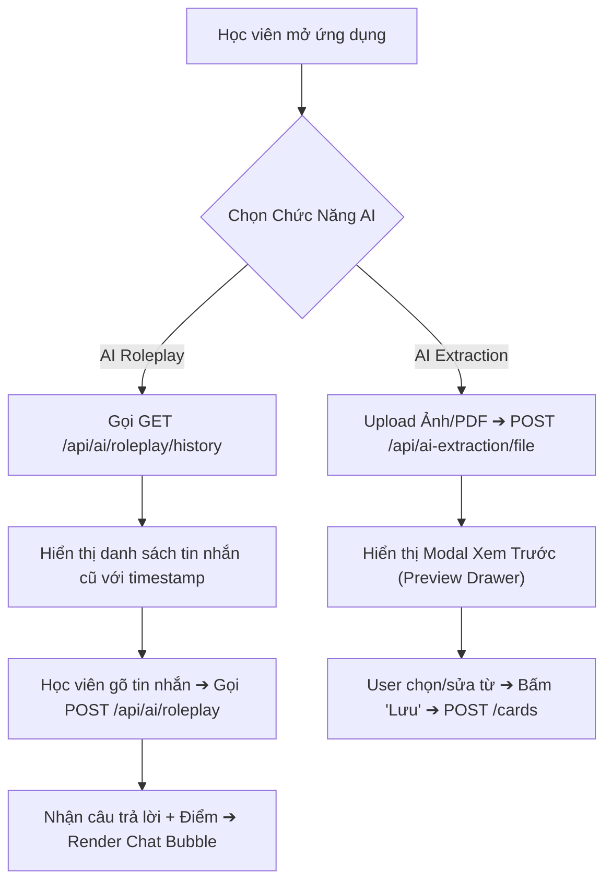

# 🤖 HƯỚNG DẪN TÍCH HỢP VÀ KIỂM THỬ CHI TIẾT TOÀN BỘ CÁC TÍNH NĂNG AI (AI TESTING & SWAGGER SPECIFICATION)

> **Tài liệu dành cho**: Team Frontend (FE React/Flutter), Backend Developers (BE Java/Spring Boot) & QA/Tester.  
> **API Docs Route**: `http://localhost:8080/fsoft/swagger-ui.html` | OpenAPI Specs: `/v3/api-docs`  
> **LLM Engines**: Groq Llama 3 (`openai/gpt-oss-120b`) & Gemini 1.5 Flash Vision (`gemini-2.5-flash`).

---

## 📌 MỤC LỤC
1. [Tổng Quan Kiến Trúc AI & Trụ Cột Enterprise](#1-tổng-quan-kiến-trúc-ai--trụ-cột-enterprise)
2. [Chi Tiết Swagger Schema & Field-by-Field Spec Dành Cho 7 AI Use-Cases](#2-chi-tiết-swagger-schema--field-by-field-spec)
   - [Use-Case 1: AI Vocabulary Extraction (Text & URL)](#use-case-1-ai-vocabulary-extraction-text--url)
   - [Use-Case 2: Gemini Multimodal Vision OCR (File Ảnh & PDF)](#use-case-2-gemini-multimodal-vision-ocr-file-ảnh--pdf)
   - [Use-Case 3: AI Magic Sort (Tự Động Phân Bổ Thẻ Bài)](#use-case-3-ai-magic-sort-tự-động-phân-bổ-thẻ-bài)
   - [Use-Case 4: AI Situational Learning (Bài Học Tình Huống Tương Tác)](#use-case-4-ai-situational-learning-bài-học-tình-huống-tương-tác)
   - [Use-Case 5: AI Story Generator (Ghép Từ SRS Nợ Thành Đoạn Văn)](#use-case-5-ai-story-generator-ghép-từ-srs-nợ-thành-đoạn-văn)
   - [Use-Case 6: AI One-Click Auto Deck Generator (Tạo Bộ Bài Tự Động 3s)](#use-case-6-ai-one-click-auto-deck-generator-tạo-bộ-bài-tự-động-3s)
   - [Use-Case 7: AI Roleplay Tutor & Multi-Turn Conversation Memory](#use-case-7-ai-roleplay-tutor--multi-turn-conversation-memory)
   - [Use-Case 8: Smart Anti-Burnout SRS Queue (Hàng Chờ Bài Học 2 Phút)](#use-case-8-smart-anti-burnout-srs-queue-hàng-chờ-bài-học-2-phút)
3. [Quy Trình Tích Hợp Frontend (FE Workflow & Component Mapping)](#3-quy-trình-tích-hợp-frontend)
4. [Hướng Dẫn Kiểm Thử Backend & Database (PostgreSQL & Logs)](#4-hướng-dẫn-kiểm-thử-backend--database)

---

## 1. TỔNG QUAN KIẾN TRÚC AI & TRỤ CỘT ENTERPRISE

Backend `fsoft-project-server` vận hành hệ thống AI dựa trên **5 Trụ Cột Enterprise**:

1. **Multimodal Dispatcher**: Tự động chuyển hướng câu hỏi Text-only sang Groq Llama 3 (< 1.5s latency) và tài liệu File Ảnh/PDF sang Gemini 1.5 Flash Vision.
2. **Prompt Isolation (`.st` Template Files)**: Tách 100% Prompts ra khỏi Java code đặt trong `src/main/resources/prompts/`.
3. **Resilient JSON Sanitizer**: Tự động lọc bỏ các ký tự Markdown code block (````json ... ````) trước khi parse sang DTO Java để triệt tiêu lỗi Exception 500.
4. **JDBC Chat Memory Persistence**: Lưu vết lịch sử trò chuyện đối thoại đa lượt vào bảng PostgreSQL `spring_ai_chat_memory` theo mốc thời gian thực tế.
5. **Defensive Length Guard**: Bảo vệ độ dài `conversationId` tối đa 36 ký tự để thích ứng hoàn hảo với DDL schema trong PostgreSQL.

---

## 2. CHI TIẾT SWAGGER SCHEMA & FIELD-BY-FIELD SPEC

---

### USE-CASE 1: AI Vocabulary Extraction (Text & URL)

#### 📌 Endpoint 1.1: Trích xuất từ vựng từ đoạn văn thô
- **HTTP Method**: `POST`
- **Path**: `/api/ai-extraction/text`
- **Swagger Tag**: `AI Extraction Controller`

##### 📥 Request Body (`TextExtractionRequest`):
| Field Name | Type | Required | Description | Example |
| :--- | :--- | :--- | :--- | :--- |
| `text` | `String` | **Có** | Đoạn văn bản Tiếng Anh cần bóc tách từ vựng | `"Artificial Intelligence is transforming software velocity."` |
| `targetLanguage` | `String` | Không | Ngôn ngữ đích dịch nghĩa (Mặc định `"vi"`) | `"vi"` |
| `topic` | `String` | Không | Chủ đề định hướng cho AI trích xuất từ vựng | `"Công nghệ thông tin"` |

##### 📤 Response Data (`ApiResponse<List<ExtractedCardResponse>>`):
| Field Name | Type | Description | Example |
| :--- | :--- | :--- | :--- |
| `word` | `String` | Từ vựng Tiếng Anh trích xuất được | `"velocity"` |
| `phonetic` | `String` | Phiên âm quốc tế IPA chuẩn | `"/vəˈlɒsəti/"` |
| `meaning` | `String` | Nghĩa tiếng Việt chuẩn ngữ cảnh bài đọc | `"tốc độ, vận tốc phát triển"` |
| `example` | `String` | Câu ví dụ minh họa trích từ bài hoặc AI tạo | `"AI accelerates software development velocity."` |

---

### USE-CASE 2: Gemini Multimodal Vision OCR (File Ảnh & PDF)

#### 📌 Endpoint 2.1: Trích xuất từ vựng từ File Ảnh / PDF Scan
- **HTTP Method**: `POST`
- **Path**: `/api/ai-extraction/file`
- **Consumes**: `multipart/form-data`
- **Swagger Tag**: `AI Extraction Controller`

##### 📥 Form Data Request:
| Field Name | Type | Required | Description |
| :--- | :--- | :--- | :--- |
| `file` | `MultipartFile` | **Có** | File ảnh (`.png`, `.jpg`, `.jpeg`) hoặc tài liệu (`.pdf`) |
| `targetLanguage` | `String` | Không | Ngôn ngữ dịch nghĩa (Mặc định `"vi"`) |
| `topic` | `String` | Không | Chủ đề gợi ý cho Gemini Vision |

##### 📤 Response Data:
Trả về danh sách `List<ExtractedCardResponse>` tương tự Endpoint 1.1.

---

#### 📌 Endpoint 1.3: ⚡ Real-Time Card Autocomplete & Definition Suggestions (Giống Quizlet)
- **HTTP Method**: `GET`
- **Path**: `/api/ai/extract/suggestions`
- **Swagger Tag**: `AI Extraction`

##### 📥 Query Parameters:
| Param Name | Type | Required | Description | Example |
| :--- | :--- | :--- | :--- | :--- |
| `query` | `String` | **Có** | Chuỗi từ vựng học viên đang vừa gõ ở ô TERM | `"meet"` |

##### 📤 Response Data (`ApiResponse<CardSuggestionResponse>`):
| Field Name | Type | Description | Example |
| :--- | :--- | :--- | :--- |
| `query` | `String` | Từ vựng / Cụm từ đang được truy vấn | `"meet"` |
| `termSuggestions` | `List<String>` | Danh sách các gợi ý hoàn thiện từ vựng Tiếng Anh (Gợi ý bên dưới ô TERM) | `["meet", "meeting", "meet, met, met"]` |
| `definitionSuggestions` | `List<String>` | Danh sách các gợi ý nghĩa Tiếng Việt tương ứng (Gợi ý bên dưới ô DEFINITION) | `["gặp", "đáp ứng", "gặp gỡ"]` |
| `autoFillCard` | `CardCreationRequest` | Thông tin đầy đủ của thẻ bài để tự động điền IPA, Từ loại, Ví dụ | `{"word": "meet", "phonetic": "/miːt/", "partOfSpeech": "verb", "meaning": "gặp gỡ"...}` |

---

### USE-CASE 3: AI Magic Sort (Tự Động Phân Bổ Thẻ Bài)

#### 📌 Endpoint 3.1: Gợi ý phân bổ danh sách từ vào các Bộ bài phù hợp
- **HTTP Method**: `POST`
- **Path**: `/api/ai-extraction/magic-sort`
- **Swagger Tag**: `AI Extraction Controller`

##### 📥 Request Body (`MagicSortRequest`):
| Field Name | Type | Required | Description | Example |
| :--- | :--- | :--- | :--- | :--- |
| `cardIds` | `List<Long>` | **Có** | Danh sách ID các thẻ từ vựng chưa phân loại | `[101, 102, 103]` |
| `deckIds` | `List<Long>` | **Có** | Danh sách ID các Bộ bài hiện có của người dùng | `[1, 2, 3]` |

##### 📤 Response Data (`ApiResponse<List<MagicSortResult>>`):
| Field Name | Type | Description | Example |
| :--- | :--- | :--- | :--- |
| `deckId` | `Long` | ID của Bộ bài mục tiêu | `1` |
| `deckTitle` | `String` | Tên của Bộ bài mục tiêu | `"IT Terms"` |
| `cardIds` | `List<Long>` | Danh sách ID các thẻ từ vựng được AI gom vào Bộ bài này | `[101, 103]` |

---

### USE-CASE 4: AI Situational Learning (Bài Học Tình Huống Tương Tác)

#### 📌 Endpoint 4.1: Tạo bài học tình huống thực tế kèm bài tập trắc nghiệm
- **HTTP Method**: `POST`
- **Path**: `/api/ai/situational-learning`
- **Swagger Tag**: `AI Situational Learning Controller`

##### 📥 Request Body (`SituationalLearningRequest`):
| Field Name | Type | Required | Description | Example |
| :--- | :--- | :--- | :--- | :--- |
| `context` | `String` | **Có** | Mô tả tình huống giao tiếp muốn thực hành | `"Đi phỏng vấn xin việc vị trí Java Developer"` |
| `location` | `String` | Không | Địa điểm diễn ra tình huống | `"Văn phòng công ty FPT Software"` |
| `currentTime` | `String` | Không | Thời gian diễn ra tình huống | `"Morning"` |

##### 📤 Response Data (`ApiResponse<SituationalLearningResponse>`):
| Field Name | Type | Description |
| :--- | :--- | :--- |
| `scenarioDescription` | `String` | Bối cảnh tình huống chi tiết bằng Tiếng Việt |
| `dialogue` | `List<DialogueLine>` | Đoạn hội thoại mẫu giữa 2 nhân vật (Role, Text, Translation) |
| `vocabulary` | `List<CoreVocab>` | Các từ vựng cốt lõi trong tình huống kèm phát âm và ví dụ |
| `quizOptions` | `List<QuizQuestion>` | Bài tập trắc nghiệm 4 đáp án (Question, Options, CorrectIndex, Explanation) |

---

### USE-CASE 5: AI Story Generator (Ghép Từ SRS Nợ Thành Đoạn Văn)

#### 📌 Endpoint 5.1: Sinh đoạn văn / Business Email chứa từ nợ FSRS
- **HTTP Method**: `POST`
- **Path**: `/api/ai/story`
- **Swagger Tag**: `AI Story Controller`

##### 📥 Request Body (`AiStoryRequest`):
| Field Name | Type | Required | Description | Example |
| :--- | :--- | :--- | :--- | :--- |
| `words` | `List<String>` | **Có** | Danh sách các từ vựng SRS nợ cần ghép vào bài | `["negotiation", "consensus", "deadline"]` |
| `contextType` | `String` | Không | Ngữ cảnh văn bản (`BUSINESS_EMAIL`, `DAILY_NEWS`, `CASUAL_CHAT`) | `"BUSINESS_EMAIL"` |

##### 📤 Response Data (`ApiResponse<AiStoryResponse>`):
| Field Name | Type | Description | Example |
| :--- | :--- | :--- | :--- |
| `title` | `String` | Tiêu đề của đoạn văn / Email | `"Urgent Project Proposal & Negotiation"` |
| `storyText` | `storyText` | Đoạn văn Tiếng Anh hoàn chỉnh lồng ghép từ vựng | `"Dear Team, We need to reach a consensus..."` |
| `translationText` | `String` | Bản dịch Tiếng Việt mượt mà | `"Thưa Team, Chúng ta cần đạt được sự đồng thuận..."` |
| `targetWords` | `List<String>` | Danh sách các từ đã được lồng ghép thành công | `["consensus", "deadline", "proposal"]` |

---

### USE-CASE 6: AI One-Click Auto Deck Generator (Tạo Bộ Bài Tự Động 3s)

#### 📌 Endpoint 6.1: Sinh nguyên bộ bài Flashcard chuẩn chỉ trong 3 giây
- **HTTP Method**: `POST`
- **Path**: `/api/ai/auto-deck`
- **Swagger Tag**: `AI Auto Deck Controller`

##### 📥 Request Body (`AiAutoDeckRequest`):
| Field Name | Type | Required | Description | Example |
| :--- | :--- | :--- | :--- | :--- |
| `topic` | `String` | **Có** | Chủ đề bất kỳ người dùng muốn tạo bộ bài | `"Từ vựng phỏng vấn IT ReactJS"` |
| `cardCount` | `Integer` | Không | Số lượng thẻ muốn tạo (Default: `15`, Max: `30`) | `15` |
| `sourceLanguage` | `String` | Không | Ngôn ngữ nguồn (Default: `"en"`) | `"en"` |
| `targetLanguage` | `String` | Không | Ngôn ngữ dịch (Default: `"vi"`) | `"vi"` |

##### 📤 Response Data (`ApiResponse<AiAutoDeckResponse>`):
| Field Name | Type | Description |
| :--- | :--- | :--- |
| `title` | `String` | Tiêu đề bộ bài được AI biên soạn chuẩn SEO |
| `description` | `String` | Mô tả ngắn tổng quan về bộ bài |
| `cards` | `List<GeneratedCard>` | Danh sách các thẻ từ vựng hoàn chỉnh (Word, IPA, Meaning, Example) |

---

### USE-CASE 7: AI Roleplay Tutor & Multi-Turn Conversation Memory

#### 📌 Endpoint 7.1: Gửi tin nhắn chat đối thoại đóng vai
- **HTTP Method**: `POST`
- **Path**: `/api/ai/roleplay`
- **Swagger Tag**: `AI Roleplay Controller`

##### 📥 Request Body (`AiRoleplayRequest`):
| Field Name | Type | Required | Description | Example |
| :--- | :--- | :--- | :--- | :--- |
| `scenario` | `String` | Không | Kịch bản (`JOB_INTERVIEW`, `DOCTOR_APPOINTMENT`, `HOTEL_CHECKIN`, `RESTAURANT`) | `"JOB_INTERVIEW"` |
| `targetWords` | `List<String>` | Không | Danh sách từ vựng mục tiêu học viên ép dùng | `["deadline", "proposal"]` |
| `conversationId` | `String` | Không | ID phiên hội thoại (Max 36 chars). Nếu rỗng dùng User ID | `"session-interview-01"` |
| `userMessage` | `String` | **Có** | Câu trả lời Tiếng Anh thô của học viên | `"In my last project, I met the deadline."` |

##### 📤 Response Data (`ApiResponse<AiRoleplayResponse>`):
| Field Name | Type | Description | Example |
| :--- | :--- | :--- | :--- |
| `tutorReply` | `String` | Câu đáp lại tiếp theo của Gia sư AI (Tiếng Anh tự nhiên) | `"Great! Can you tell me how you managed unexpected bugs?"` |
| `score` | `Integer` | Điểm số đánh giá lượt nói (0 - 100) | `95` |
| `wordsUsed` | `List<String>` | Từ mục tiêu học viên dùng thành công | `["deadline"]` |
| `suggestions` | `List<String>` | Lời khuyên nhận xét & sửa lỗi Tiếng Việt | `["Nên thêm liên từ 'by' để câu rõ nghĩa hơn."]` |

---

#### 📌 Endpoint 7.2: Lấy lịch sử hội thoại đối thoại sạch
- **HTTP Method**: `GET`
- **Path**: `/api/ai/roleplay/history`
- **Swagger Tag**: `AI Roleplay Controller`

##### 📥 Query Parameters:
| Param Name | Type | Required | Description | Example |
| :--- | :--- | :--- | :--- | :--- |
| `conversationId` | `String` | Không | ID phiên hội thoại (Nếu rỗng lấy theo User ID hiện tại) | `"session-interview-01"` |

##### 📤 Response Data (`ApiResponse<List<AiRoleplayHistoryResponse>>`):
| Field Name | Type | Description | Example |
| :--- | :--- | :--- | :--- |
| `role` | `String` | Vai trò gửi tin nhắn (`USER` hoặc `ASSISTANT`) | `"USER"` |
| `content` | `String` | Nội dung tin nhắn thô sạch (Đã lọc bỏ prompt rác và JSON wrapper) | `"In my last project, I met the deadline."` |
| `createdAt` | `LocalDateTime` | Mốc thời gian gửi tin nhắn chuẩn CSDL PostgreSQL | `"2026-08-27T21:23:41"` |

---

#### 📌 Endpoint 7.3: Xóa/Reset bộ nhớ phiên đối thoại
- **HTTP Method**: `DELETE`
- **Path**: `/api/ai/roleplay/{conversationId}`
- **Swagger Tag**: `AI Roleplay Controller`

##### 📥 Path Variables:
| Variable Name | Type | Required | Description |
| :--- | :--- | :--- | :--- |
| `conversationId` | `String` | **Có** | ID phiên hội thoại cần dọn dẹp bộ nhớ |

##### 📤 Response Data:
`{"status": 200, "message": "Hỏi đáp AI thành công", "data": null}`

---


## 3. QUY TRÌNH TÍCH HỢP FRONTEND (FE WORKFLOW)



---

## 4. HƯỚNG DẪN KIỂM THỬ BACKEND & DATABASE

### 🧪 Query SQL Kiểm Tra CSDL PostgreSQL:
Mở pgAdmin hoặc DBeaver và chạy câu lệnh kiểm tra dữ liệu hội thoại chat memory:
```sql
SELECT conversation_id, sequence_id, type, content, "timestamp"
FROM spring_ai_chat_memory
WHERE conversation_id = 'session-interview-01'
ORDER BY sequence_id ASC;
```

### ⚡ Kiểm Tra Performance & Token Usage:
Xem log trên Terminal console của Spring Boot:
```text
INFO: Tokens this call: prompt=833 completion=325 total=1158
INFO: Bắt đầu AI Roleplay Tutor kịch bản: JOB_INTERVIEW
```
- **Mục tiêu**: Tốc độ phản hồi Text-only AI < 1.5s, Multimodal Vision OCR < 3.0s, và không phát sinh bất kỳ SQL Exception nào!
